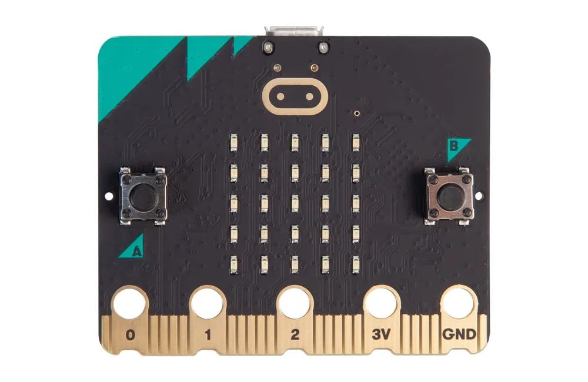

# Rust tools 

1. `rustup` : The Rust Toolchain Installer. This installs all the required Rust tools. 
2. `cargo` : The official package manager of Rust. It downloads your dependencies, compiles your packages , makes distributable binaries and also uploads them to  [](crates.io), the official Rust package registry.
3. `rustc` : The Rust compiler.

## Creating a new project in Rust

To create a new Rust project we use the below command 

```bash
cargo new <project_name>

#OR

cargo new --bin <project_name>
```

Here `--bin` makes sure that the new project created is a program and not a library.

---

# The project directory structure - 1

Once you have run the command `cargo new`, you will get a project directory with the following structure : 

```md
 .
├──  Cargo.lock
├──  Cargo.toml
└──  src
    └──  main.rs
```
## `Cargo.toml`

This is the file containing all the metadata of the project. It contains stuff like the Project Name, Rust version used, Project Dependencies etc. Here is a barebones `Cargo.toml`

```toml
[package]
name = "project_name"   # The name of your crate/project
version = "0.1.0"       # The current version of your project (semver format)
edition = "2021"        # Rust edition (2015, 2018, or 2021 are valid)

[dependencies]
# This section is where you list external crates your project depends on.
# Format: crate_name = "version"
```

---

# The project directory structure - 2

## `src.main.rs`

This is the main file where we write our Rust programs. `cargo` generates a default `Hello, World` program as shown below. If you are using `presenterm` to present this file, press `CTRL + E` to execute the code.

```rust +exec
fn main() {
  println!("Hello, world!");
}
```

---
# The project directory structure - 3

## Building the code

To build the code, run the below command in your project's root directory, the executable binary (ELF for Linux and EXE for Windows) will be available in the `target/debug` directory) : 

```bash
cargo build
```

## Running the code

To run the Rust code, run the below command in your project's root directory : 

```bash
cargo run
```
This command first builds the code and then runs it. So `cargo build` is optional.

To optimize the binary, we use the `--release` flag since by default Rust builds for debugging which increases the binary size.

```bash
cargo run --release
```


---

# `Hello, world!` program breakdown

```rust +exec
fn main() {
  println!("Hello, world!");
}
```

## `fn main() { ... }`

1. `fn` -> Keyword for defining a function in Rust
2. `main` -> The entry point of a Rust program. All the program's logic will be written inside the `main` function. This is similar to `int main()` in C/C++.

## `println!("Hello, world!);`

`println!` is a macro which prints output to terminal with a newline `\n` at the end. To print the output without the newline use the `print!` macro instead.

Note the Semicolon (`;`) at the end. This indicates the end of the line.

---

# Hardware

1. BBC Microbit V2



---
# Variables in Rust

To define a variable in Rust, we use the `let` keyword.

## Immutable variables

This is the default type of variables in Rust. Here the value cannot be modified or changed.

## Mutable Variables

The value of this variable can be modified or changed. To define a mutable variable, we use the `mut` keyword. 

```rust +exec
fn main() {
  let x = 45;      // Immutable variable
  let mut y = 56;  // Mutable variable
  println!("Immutable variable : {x}");
  println!("Mutable Variable : {y}");
  y *= 2;
  print!("Modified value : {y}");
}
```

---

# Data types in Rust - 1

## Integers

Integers in Rust are scalar types that represent whole numbers, available in both signed (iN) and unsigned (uN) forms with fixed bit-widths (8, 16, 32, 64, 128, or pointer-sized).

### Signed integers

| Type   | Size    |
|--------------- | --------------- |
| `i8`   | 8 bits   |
| `i16`   | 16 bits   |
| `i32`   | 32 bits   |
| `i64`   | 64 bits   |
| `i128`   | 128 bits   |
| `isize`   | Pointer-sized (Depends on architecture)   |

<!--new_line-->

### Unsigned Integers


| Type   | Size    |
|--------------- | --------------- |
| `u8`   | 8 bits   |
| `u16`   | 16 bits   |
| `u32`   | 32 bits   |
| `u64`   | 64 bits   |
| `u128`   | 128 bits   |
| `usize`   | Pointer-sized (Depends on architecture)   |


---

## Floating point

Floating point numbers are basically decimal numbers

### Float types

| Type | Size |
| -------------- | --------------- |
| `f32` | 32 bits |
| `f64` | 64 bits |


## Boolean (`bool`)

Boolean can have only 2 values `true` and `false`

## Character (`char`)

This has a size of 4 bytes and is used to represent a single Unicode Scalar value.


---

# Program that prints all datatypes

```rust +exec
fn main() {
  let a: i16 = -25;     // 16-bit signed integer
  let b: u32 = 45;      // 16-bit unsigned integer
  let c: f32 = 256.32;  // 32-bit Floating point value
  let d: char = 'c';    // Character
  let e: bool = true;   //Boolean

  println!("16-bit signed Integer : {}", a);
  println!("16-bit unsigned Integer : {}", b);
  println!("32-bit Floating point value : {}", c);
  println!("Character : {}", d);
  println!("Boolean value : {}", e);
}
```

---
# Strings in Rust

In Rust (Or any language for that matter), a string is a collection of characters.

## String types

1. `String` -> An owned, growable, heap-allocated UTF-8 string.
2. `&str` (**String Slice**) -> A borrowed view of `String`, often used for String literals.

```rust +exec
fn main() {
    let slice: &str = "Hello";  
    println!("slice: {}", slice);
    let mut owned: String = String::from("Hello");
    owned.push_str(", world!"); // we can modify it
    println!("owned: {}", owned);
    let borrowed: &str = &owned;
    println!("borrowed from String: {}", borrowed);
}
```

---

# Specify datatype of a number

```rust +exec
fn main() {
  let x = 3u8 - 2u8;     // Specifying datatype as u8
  let y = 4i8 - 10i8;     // Specifying datatype as i8

  println!("{x}");
  println!("{y}");
}
```
---

# Type casting

This is used to change from one datatype to another. 

Type casting uses the `as` keyword. 

```rust +exec
fn main() {
  let x = 4u32 - 3i16 as u32;

  println!("{x}");
}
```

---

# Control Flow in Rust

1. `if-else` -> Conditional branching based on a boolean expression
2. `if let` -> Pattern-matching shorthand for `if` with a single pattern
3. `match` -> Exhaustive branching based on patterns.
4. `loop` -> Infinite loop that runs unless explicitly broken.
5. `while` -> Loop that runs until the given condition becomes false.
6. `while let` -> Loop that run until a given pattern matches.
7. `for` -> Iterate over the elements of an iterator.
8. `break` -> Exits a loop
9. `continue` -> Skips to the next loop iteration. 
10. `return` -> Exits a function and returns a value.

---

# `if-else` statements

These are used to evaluate a condition and returns one of two or more values depending on whether the condition is `true` or `false`

## Example

```rust +exec
fn main(){
  let b = 0.5;
  if b > 0.1 {
    println!("{b} > 0.1");
  } else {
    println!("{b} < 0.1");
  }
}
```

---

# `if-let` statement

This statement runs a code if a value matches a single pattern.

## Example

```rust +exec
fn main() {
    let opt = Some(10);
    if let Some(val) = opt {
        println!("val is {}", val);
    }
}
```
---

# `match` statement

Performs branching by matching patterns exhaustively. Similar to `switch-case` of C/C++.

```rust +exec 
fn main() {
  let num = 2;
  match num {
      1 => println!("One"),
      2 => println!("Two"),
      _ => println!("Something Else : {}", num)
  }
}
```

---

# `loop` statement

Creates an infinite loop until explicitly broken.

```rust +exec
fn main() {
  let mut count = 0;
  loop {
    count += 1;
    if count == 3 {
        println!("Breaking at count = {count}");
        break;
    }
  }
}
```

---

# `while` statement

Loops as long a given statement is `true`

```rust +exec
fn main() {
  let mut n = 3;
  while n > 0 {
      println!("n : {n}");
      n -= 1;
  }
}
```
---

# `while let` statement

Loops until the given value matches a pattern.

```rust +exec
fn main() {
  let mut opt = Some(3);
  while let Some(val) = opt {
    println!("{val}");
    opt = if val > 1 {
      Some(val - 1)
    } else {
      None
    };
  }
}
```

---

# `for` loop

Iterates over the items in an iterator

```rust +exec
fn main() {
  for i in 1..=4{   // Also includes 4 as part of the for loop
      println!("{i}");
  }
}
```

---

# `break` statement

Exits a loop immediately

```rust +exec

fn main() {
  for i in 1.. {   // Iterates from 1 to infinity
    if i == 3 {
        break;
    }
    println!("{i}");
  }
}
```

---

# `continue` statement

Skips the rest of the current loop iteration

```rust +exec
fn main() {
  for i in 1..5 {
    if i == 3 {
      continue;
    }
    println!("{i}");
  }
}
```

---

# `return` statement

Exits a function and returns a value

Two ways to return a value from a function

<!--column_layout: [1, 1]-->

<!--column: 0-->
## Using `return` statement 

```rust +exec
fn square(x: i32) -> i32 {  // Returns i32
    return x * x;
}

fn main() {
  let n: i32 = square(4);
  println!("Square of 4 is : {n}");

}
```

<!--column: 1-->

## Without using `return` statement


```rust +exec
fn square(x: i32) -> i32 {
  x * x        // There is no semicolon (;) here 
}

fn main() {
  let val: i32 = square(4);
  println!("Square of 4 is : {val}");
}
```

---

# Functions in Rust

Functions are reusable blocks of code that may or may not return a value.

```rust +exec
fn ret_val(x: i32) -> f64 {   // Return f64
  x as f64     // Change i32 to f64 and return it
}

fn print_smth() {
  println!("Function call");       //This function doesn't return anything
}

fn main() {
  print_smth();
  let num: i32 = 89;
  let ret_num: f64 = ret_val(num);
  println!("Returned value : {ret_num}");
}
```

---

# Memory in Rust

Memory in Rust is managed through ownership, borrowing, and lifetimes, ensuring safety without a garbage collector.

## Example 

```rust +exec
fn main() {
    let s1 = String::from("Hello"); // allocated on the heap
    let s2 = &s1;                   // borrowed reference (no copy)
    println!("s1: {}, s2: {}", s1, s2);
} // memory for `s1` is automatically freed here
```

---

# References vs Pointers in Rust

| Feature | References (`&T`, `&mut T`) | Raw Pointers (`*const T`, `*mut T`) |
| --------------- | --------------- | --------------- |
| Safety | Always safe | Unsafe, can cause undefined behaviour |
| Nullability | Cannot be NULL | Can be `NULL` (NULL Pointers) |
| Dereferencing | Safe, no `unsafe` block required | Requires `unsafe` block |
| Lifetimes | Must follow lifetime rules | No lifetime checks |
| Mutability | `&T` is immutable, `&mut T` is mutable | `*const T` is immutable, `*mut T` is mutable |
| Ownership | Enforces (No dangling, aliasing) | Not enforced (May cause dangling pointers) |
| Usage | Everyday Rust code (Safe borrowing) | Low level memory manipulation |


---

# References vs Pointers in Rust (Example Code)

<!--column_layout: [1, 1]-->
<!--column: 0-->

## References (Safe)

```rust +exec
fn main() {
    let x = 42;
    let r: &i32 = &x;   // reference to x (safe)
    println!("Reference points to: {}", r);
}
```

<!--column: 1-->

## Pointers (Unsafe)

```rust +exec
fn main() {
    let x = 42;
    let p: *const i32 = &x;   // raw pointer to x

    unsafe {
        println!("Raw pointer points to: {}", *p); // dereference requires unsafe
    }
}
```

---

# Print memory address of a reference 

The below program prints the memory address of a value's reference

```rust +exec
fn main() {
  let x: i32 = 57;
  println!("Value: {x}");
  println!("Memory location: {:p}", &x);
}
```
